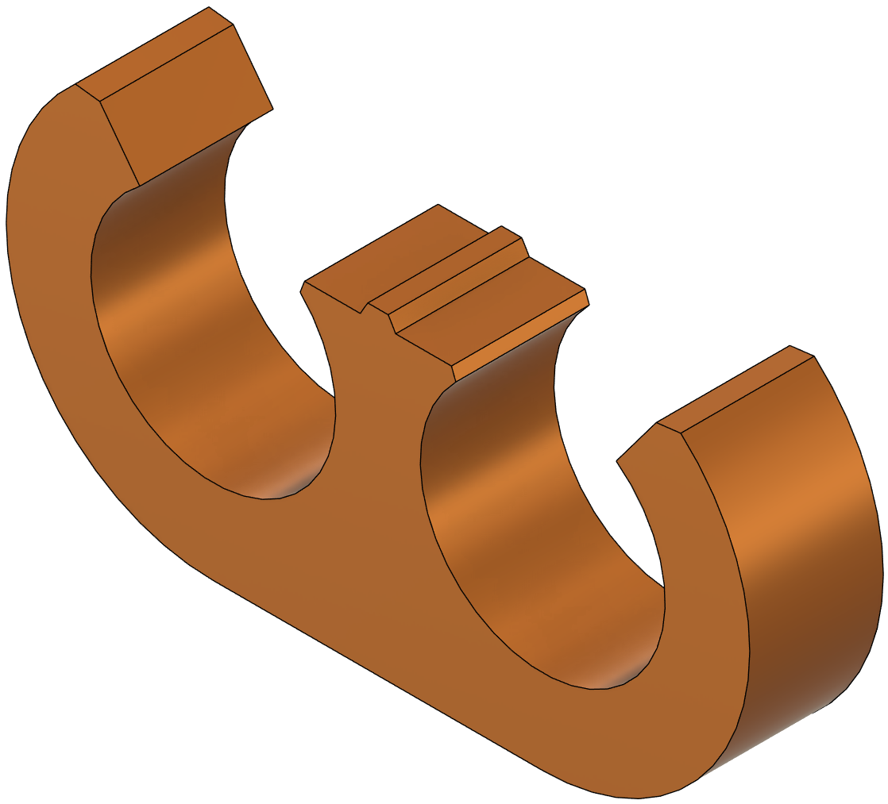
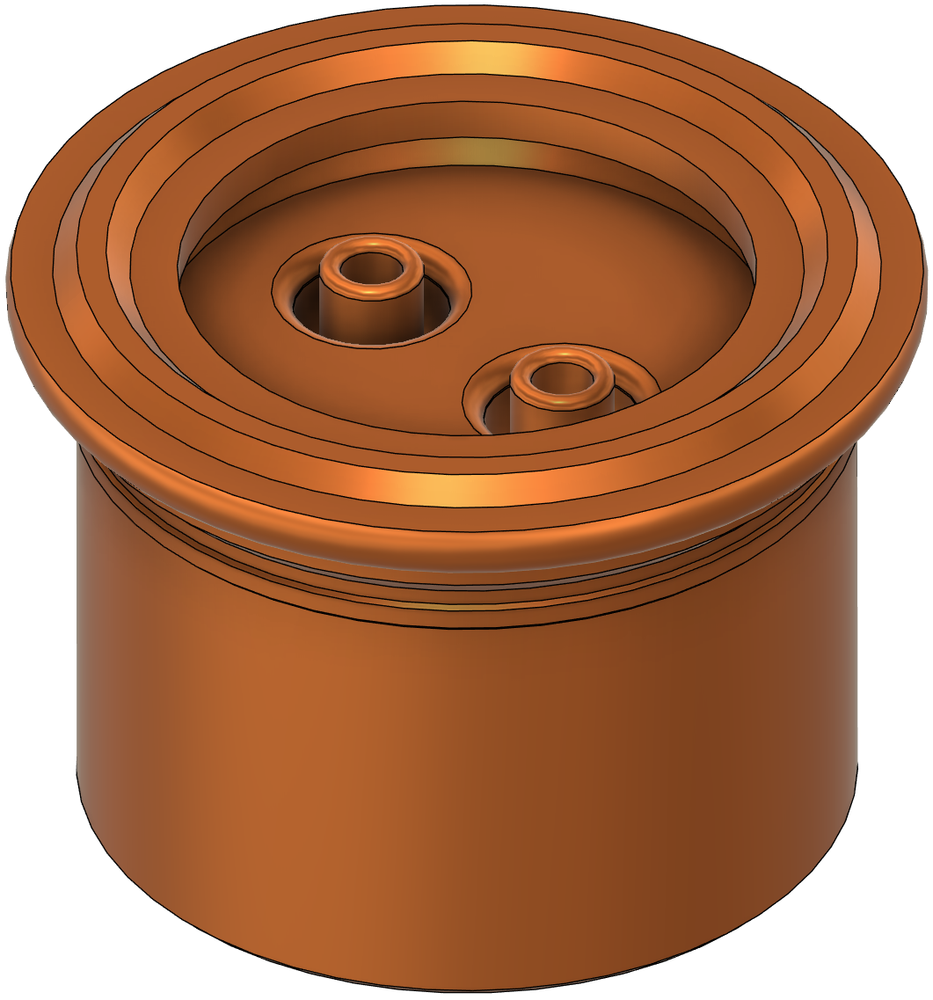
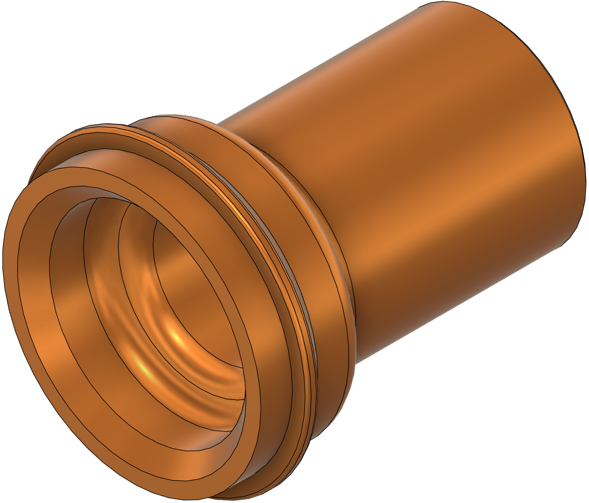

# Guide

Work in progress

This is the guide to the Open Source VacBed by VacTek.
It works well with our AutoRegulator

TODO link to AutoRegulator

## Preface

This guide assumes you know what a vacbed is, how it works, and that you want to build one.
Sourcing is US-oriented. And, as you've heard 1000x before: Never use it alone!

### Features

+ Everything you need to experience a vacbed, and probably more!
+ Air-tight & quiet vac
+ Collapsible
+ Mask that takes pressure off the nose

## Supplies & Tools List

### General Tools

+ Sandpaper, around 150 grit
+ Silver Sharpie (for marking on PVC and latex; it washes off with Heptane) [Link](https://a.co/d/dIjm3Gn)
+ Measuring tape
+ Calipers (optional, but useful)
+ Philips screwdriver (for disassembling air pump)
+ Flathead screwdriver (optional, pry tool)

### Supplies for Frame

+ 2x 10-ft PVC pipe, 1" class (actual OD 1.315") SCH40 
+ 3x PVC right-angle joints
+ 2x PVC straight-through connectors
+ PVC T-joint
+ PVC ball valve
+ PVC primer and glue, or you can use a primer+glue combination
+ Any saw or pipe cutter to cut the pipe (or have them cut at the hardware store)
+ Metal file
+ 15 ft of bungee cord
+ Electric drill with a 3/16" drill bit (or around 4-5mm diameter bit) & 7/16" NPT bit for pressure gauge
+ Deburring tool or countersinking bit
+ Paper towels & dish soap (to clean the pipes)

Ensure all the PVC parts are the same size-class (1") and fit together.

### Supplies for VacBag

+ 6 yd of latex sheeting that is 1 meter wide, at a minimum. [Link](https://mjtrends.com/categories-.30mm,Latex-Sheeting). I recommend a transparent variant that is 0.35-0.50mm thick, and maybe get 7 yards. Thicker latex is easier to work with, but has less of a form-revealing effect. If you plan to incorporate a sheath, you must choose black 0.40mm latex as this is how the sheaths come molded. 
+ Glue: MJTrends Adhestex solvent-based latex glue. [Link](https://mjtrends.com/products.Solvent-based-latex,Adhesive,Notions). You can also use thinned Elmer's rubber cement, or an ammonia based glue (but it will not be sweatproof!) 
+ n-Heptane solvent (aka "Bestine")
+ Stainless-steel metal seam roller [Link](https://a.co/d/inTSm42)
+ Fiskars rotary fabric cutter w/ titanium cutting wheel
+ Fabric cutting mat, as large as you can get
+ Blue painters tape
+ Q-tips (a 50 pack should be plenty)
+ Microfiber cloth
+ Titanium scissors or just fabric scissors
+ X-Acto craft knife
+ Architectural compass
+ Popsicle sticks or paintbrush [Link](https://a.co/d/gNFQL3y)
+ Wax paper (about 75 sqft)

### Vacuum Pump & Misc Supplies

+ Hygger 10W 255GPH aquarium pump kit [Link](https://a.co/d/0ZdLTgu)
+ 1x Toothpick
+ Aquarium tubing to PVC adapter (3D-printable)
+ 12x Aquarium tubing combs (3D-printable)
+ Vacuum Gauge (0 to -100 kPa/-30 inHg/-1 bar) [Link](https://a.co/d/2pvzzVl)
+ Vacuum gauge adapter (3D-printable) 
+ Teflon sealing tape
+ Clear sealing medical tape 
+ Electrical tape [Link](https://a.co/d/5DU2WuV)
+ Clamps (3D-printable) [Link](https://www.printables.com/model/974751-clamp-print-in-place)
+ Talc powder (baby powder works, but must be rinsed off after each use!)
+ Meter-stick (used as a straight edge during construction and also to seal the bed afterward) [Link](https://a.co/d/iPwYZkS)
+ Silicone CPAP cushion [Link](https://a.co/d/0kk5ap6)
+ CPAP cushion breathing tube extender (3D-printable)
+ Silicone earplugs or swimming earplugs [Link](https://a.co/d/3BA8zx5)
+ BeGloss latex shiner

## Instructions

### Step 1: The Frame

+ Wash the outside of the pipes with dish soap and water then and dry with paper towel.
+ Cut the pipes: cut into 2x 34" and 4x 40" lengths (you'll have a little left over for the valve parts)
+ If you marked the pipes to cut them, remove any Sharpie marks with some Heptane on a Q-tip.
+ Add a slight chamfer to all the ends of the pipes with a deburring tool or sandpaper. 
+ Use a file to file down any logos or ridges on the PVC joints, then sand.

TODO glue the pipe joints: which specifically?
Glue one of the scrap pieces of pipe into one end of the ball valve. Do not glue the other end!
drill holes in the pipes every 6 inches and deburr or countersink then sand

### Step 2: Cutting the Latex

Cut the following shapes out of your roll of latex, in the order listed:

+ Main rectangular sheets: 2x 102" by 1 meter 
+ Bottom edge sealing strips: 2x 21.5" by 1.5" (or 1x 41.3" by 1.5" if you bought 7 yd of latex)
+ Corner sealing squares: 2x 1.5" by 1.5"
+ Repairing strips (optional): 6x 1" by 2"
+ Breathing hole reinforcing grommets: 2x 0.5" ID, 2" OD
+ Vacuum hole reinforcing grommets: 2x 1" ID, 2.5" OD

For circular cuts, put a couple of pieces of blue tape down on your spare latex (both sides!) and use a compass to draw circles of the desired diameters, then cut with scissors or X-Acto knife. Then immediately remove the tape.

Take note of which side of each piece is shiny and which side is dull. For consistency, we want all the shiny sides facing out and the dull side on the inside of the bed.

### Step 3: Gluing the Latex

+ Make sure to have adequate ventilation before you glue, it smells and is very bad for you!
+ To prepare for gluing, put down some wax paper and put blue tape on the backside edge of both pieces of latex you are mending. Also put blue tape on the front side 0.5" from the edge to mark where you need to glue.
+ Practice on a scrap first! It takes 15 minutes of drying before you can test a seam gently, and 24 hours to be completely cured.
+ The goal is to create a cylinder with both shiny sides out; using tape to support 10" at a time. Remove tape after each segment is completed.
+ After finishing one seam, start the next seam from the same end you started the first seam from, to prevent skewing.
+ Fix wrinkled seams as you go using Heptane on the tip of a small flathead screwdriver to pry up the edge of the seam.

glue bottom edge pieces with tape trick, making sure to overlap the two edge strips, then glue corners in essence,

"For the bottom seam, cut a strip of excess latex that is about 41.3 inches by 1.5 inches. Tape the end of vac bed with painters tape to seal it wrapping it around from top to bottom sheet sealing the seam. Then turn the vac bed inside out. The tape is to hold the seam in place. Glue the strip of latex you cut along the edge, only gluing the top half of the strip along the edge of the top sheet of the vac bed and then wrap it around and glue the bottom half of the strip to the edge of the bottom sheet, making sure it is centered so that about an inch hangs off each side. Fold and glue the 1-inch pieces to themselves. Glue the top of the extra 1” and fold it back over into the vac bed and glue it down. This will eliminate the extra hanging off on both sides and help seal the corner. Then take two 1.5” x 1.5” squares of latex and glue them over the corners to further seal. This time, glue them 3/4” on the top side and wrap them around the sides of the vac bed rather then the bottom edge of the vac bed. You should only glue a 3/4” x 3/4” square with excess material hanging off the side and bottom of the bed. Then first fold around the side of the bed, gluing this piece to itself with excess extending past the bottom of the bed (earlier when you did the long strip the excess went off the sides) then fold the extra around and glue it to itself. Having these two different parts with excess first going to the side and folding over and then another piece going orthogonal with the excess extending past the end of the bed and wrapping around is what seals it" - some guy, TODO attribution

Let dry. When you turn the bed right-side-out, there will be dimples in the corners.

cut outlet hole, 1.5" diameter, 2.75" from the end of the bed, right along the right seam
glue outlet grommets using tape grain trick

at this stage, add any necessary patches to weak points along the seam in the interior

Breathing hole placement: cut a 1" diameter hole at 29.25" from the top edge of the bed in the center of the top sheet. You can place your cutting mat inside the bed to use as a backing. glue breathing hole grommets too

### Step 4: Vacuum Setup

We need to reverse the pump so it sucks air instead of blowing. First, ensure it is not plugged in, as there are exposed high voltage wires inside. Then use a screwdriver to completely disassemble the pump, isolating the beige plastic fixture in the core. Inside, there are two air chambers with two one-way rubber valves each (small black circles). Remove these rubber valves by using a toothpick to push on the stem, and then insert them back in the same hole so they face the opposite side of the air chamber. Be careful not to break the stems! Reassemble and test the pump - on 50-100% power, you should feel some suction at the silver fittings on the front of the pump.

There are two clear tubes that came with the pump. Apply combs to the them every few inches for organization.

Tap a hole in the PVC pipe that connects the frame to the ball valve located where the pressure meter will go, then apply teflon tape to the threads and screw it into the pipe.

Press-fit the clear tubing onto the adapter. Wrap a single layer of electrical tape around the end of the adapter that goes into the PVC ball valve to give it a better seal. Insert the adapter into the outer end of the ball valve.

### Step 5: Final Assembly

< WIP >
powder and shine
optional assembly with pipes oriented the right way and elastic bungee cord setup
inflation test

cpap mask with tube or latex tubing (clean it first)

